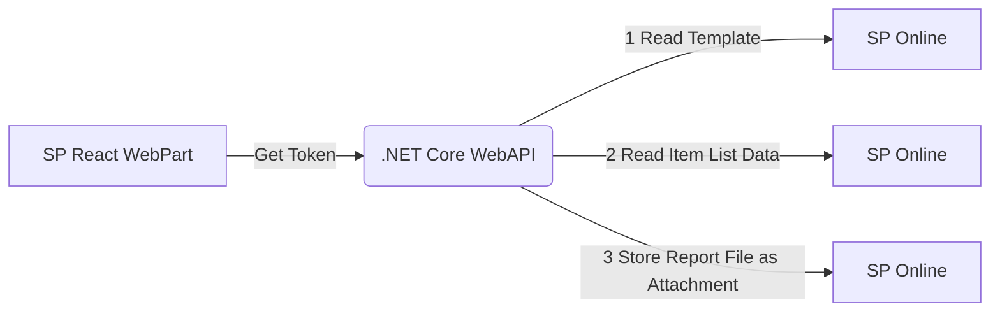

# SP React Webparts with .NET WebAPI To Create Pdf Report

Azure Ad make it possible to connecto to varios different Apis.
The webpart created for SP Online uses Azure Ad to auhenticate.
Msal within react can be used create a Json Web Token.
This webToken is verified by the web API and used for an OBO Flow to request tokens for SP. 

The report template itself is word docx Field with Mailmerge Fields uses.
The syncfusion library has advanced mail merge features, witch can fill those fields .
This word feature is usuly used for serial letters, but comes quity handy is this specific sceanrio.



## Used Components
* Spfx React Webpart
* Pnp Sdk fore Reading Data from SP
* .NET Core WebAPI
* Blazor WASM App for Testing Purposes
* Syncfusion Library for creating serial word documents and PDF Reports

## Visual Studio Template
The Template Used is a hosted Blazor WASM Application with Windows Integrated auth using MSAL.

The boilerplate code will create 2 web app registrations in Azure and provide most of the configuraration Setting out of the box.

## The .NET WebAPI Modifications

```C#
// Add services to the container.
            builder.Services.AddAuthentication(JwtBearerDefaults.AuthenticationScheme)
                .AddMicrosoftIdentityWebApi(builder.Configuration.GetSection("AzureAd"))
                .EnableTokenAcquisitionToCallDownstreamApi()
                  .AddInMemoryTokenCaches();

```
  
