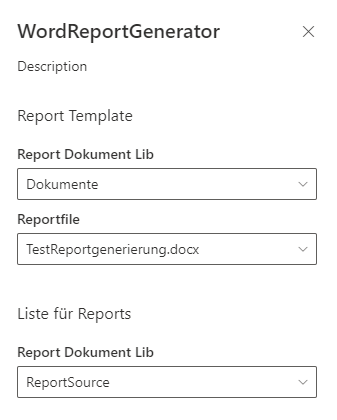
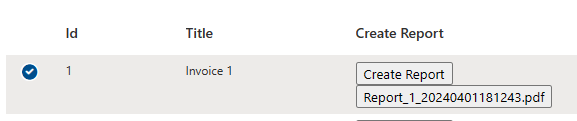
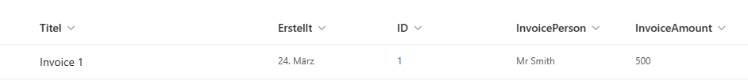
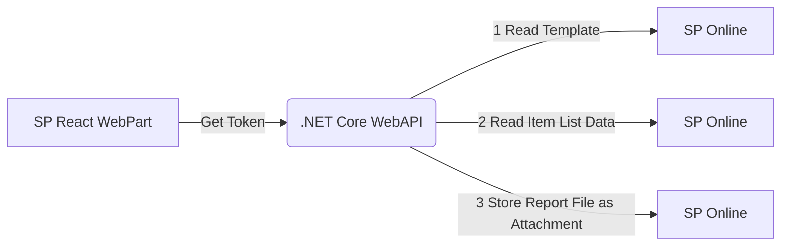

# SP React Webparts with .NET WebAPI To Create Pdf Reports

Azure Active Directory enables connectivity to various APIs. The SharePoint Online web part utilizes Azure AD for authentication.

MSAL within React can be employed to generate JSON Web Tokens, which are authenticated by the web API and utilized for an On-Behalf-Of (OBO) flow to request additional access tokens for SharePoint.

The report template is a Word document with mail merge fields.

The Syncfusion library offers advanced mail merge capabilities, which can populate these fields. Although this Word feature is typically utilized for serial letters, it proves quite useful in this specific scenario.


The web part can be configured to utilize a designated template and display a list of items for which entries can be created.



**SpFx WebPart Used for List**



The end result is an pdf File stored as attachment of then sp liste item entry.







## Used Components
* Spfx React Webpart
* Pnp Sdk fore Reading Data from SP
* .NET Core WebAPI
* Blazor WASM App for Testing Purposes
* Syncfusion Library for creating serial word documents and PDF Reports
  **This requires additional licencing depending on our scenario**

## Visual Studio Template
The template used is a hosted Blazor WebAssembly (WASM) application with Windows Integrated authentication using MSAL.

The boilerplate code will establish two web app registrations in Azure and offer most of the configuration settings out of the box.

## The .NET WebAPI Modifications

The authentication for On-Behalf-Of (OBO) is configured by utilizing the EnableTokenAcquisitionToCallDownstreamApi method.

```C#
// Add services to the container.
            builder.Services.AddAuthentication(JwtBearerDefaults.AuthenticationScheme)
                .AddMicrosoftIdentityWebApi(builder.Configuration.GetSection("AzureAd"))
                .EnableTokenAcquisitionToCallDownstreamApi()
                  .AddInMemoryTokenCaches();

```

Using PNP Sdk is quite easy.
Just add 

```C#
private async Task<PnPContext> createSiteContextForUser()
{
    var siteUrl = new Uri(_pnpCoreOptions.Sites["ReportSite"].SiteUrl);

    return await _pnpContextFactory.CreateAsync(siteUrl,
                    new ExternalAuthenticationProvider((resourceUri, scopes) =>
                    {
                        return _tokenAcquisition.GetAccessTokenForUserAsync(scopes,user:this.User);
                    }
                    ));
}

```
  
